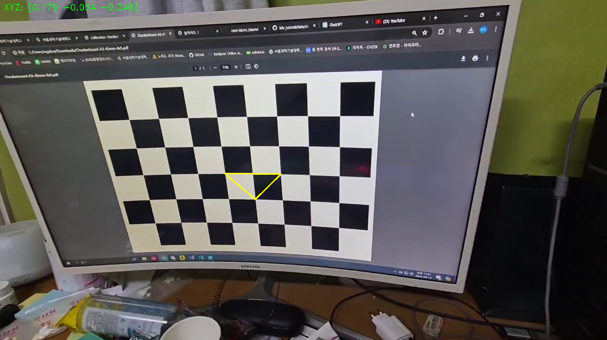
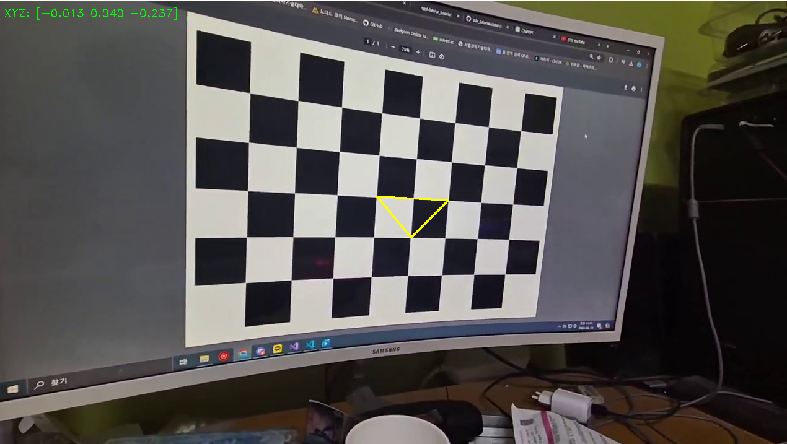
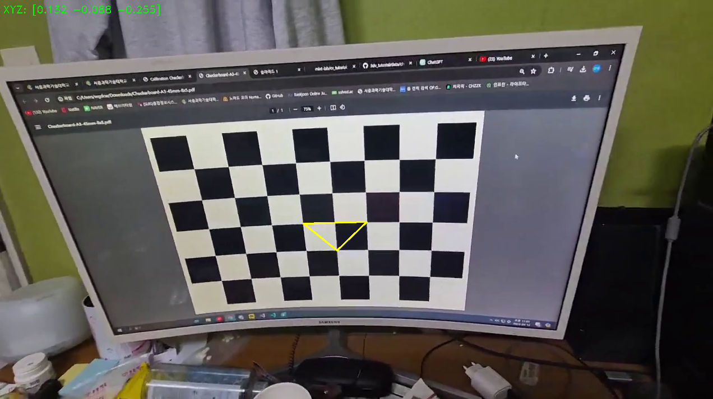

## AR triangle generator

삼각형모양을 AR을 통해 영상에 있는 모니터로 켠 체스판에 출력해주는 간단한 프로젝트

## 사용법

삼각형모양을 넣어주고싶은 영상을 찍어 chessboard.avi를 덮어씌워준다.
이때 8x5체스보드가 찍혀있어야한다.

## chessboard.avi Camera Calibration Results

- Chessboard pattern = (8, 5)
- The number of selected images = 10
- RMS error = 1.0870272305329278
- Camera matrix (K) =
- [[662.38304095 0. 617.30697704]
- [ 0. 672.73161008 404.49037234]
- [ 0. 0. 1. ]]
- Distortion coefficient (k1, k2, p1, p2, k3, ...) = [ 0.14900088 0.14887876 0.04133815 -0.00206308 -0.34159169]

## 스크린샷

